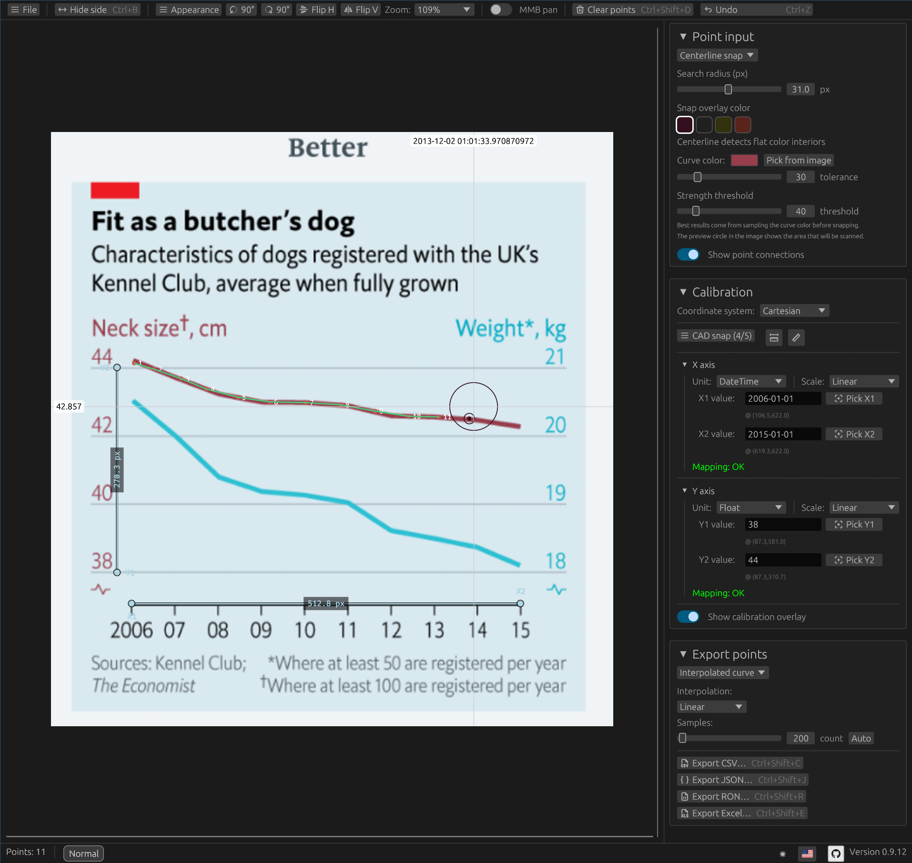

[🇺🇸 English](./README.md) · [🇷🇺 Русский](./README.ru.md)

<div align="center">

  

  <h1>Curcat — Curve Catcher</h1>

  <p>Turn curves in chart images into reusable data.</p>

</div>



[](https://github.com/hexqnt/curcat/actions/workflows/ci.yml)
[](https://github.com/hexqnt/curcat/releases/latest)

Curcat is a desktop graph digitizer for extracting numerical data from plots, scans, and screenshots. Calibrate the axes, pick a curve manually or trace it automatically, then export the result for further analysis.

## Features

- Cartesian and polar coordinate systems
- Linear and logarithmic axes, with numeric and date/time values
- Manual point picking and automatic curve tracing
- Linear, step, and natural cubic spline interpolation
- CSV, JSON, RON, XLSX, HTML, XML, and Markdown export
- Project files for saving and resuming your work
- English and Russian interface
- PNG, JPEG, GIF, BMP, TIFF, WebP, ICO, TGA, PNM, HDR, DDS, SVG, and SVGZ input

## Install and run

### Download a release

1. Open the [latest release](https://github.com/hexqnt/curcat/releases/latest).
2. Download the archive for your platform:
   - `linux-x86_64` for 64-bit Linux;
   - `windows-x86_64` for 64-bit Windows;
   - `macos-aarch64` for Apple silicon Macs.
3. Extract the archive and run `curcat` (`curcat.exe` on Windows).

On Linux or macOS, start Curcat from a terminal in the extracted directory:

```bash
chmod +x curcat # only needed if the executable bit was lost during extraction
./curcat
```

On Windows, double-click `curcat.exe` or run it from PowerShell:

```powershell
.\curcat.exe
```

You can pass an image path to open it immediately:

```bash
./curcat path/to/chart.png
```

```powershell
.\curcat.exe "C:\path\to\chart.png"
```

### Install from source

Curcat currently requires the Rust nightly toolchain. Install [Rust with rustup](https://rustup.rs/), then run:

```bash
rustup toolchain install nightly
cargo +nightly install --git https://github.com/hexqnt/curcat --locked
curcat
```

On Linux, the build also requires the standard X11/Wayland and OpenGL development packages for your distribution.

To install a local checkout instead:

```bash
git clone https://github.com/hexqnt/curcat.git
cd curcat
cargo +nightly install --path . --locked
```

## Quick start

1. Open an image using the file picker, drag and drop, or `Ctrl+V`.
2. Choose Cartesian or polar coordinates and calibrate the axes using known values on the chart.
3. Click along the curve to add points, or use automatic tracing. Hold `Shift` and drag to adjust a point or calibration line.
4. Choose **Interpolated curve** for evenly spaced samples or **Raw picked points** for the original selections.
5. Select an export format and save the data.

Curcat accepts dates such as `YYYY-MM-DD`, `YYYY-MM-DD HH:MM[:SS]`, `DD.MM.YYYY`, and `YYYY/MM/DD`.

## Shortcuts

| Shortcut             | Action                                     |
| -------------------- | ------------------------------------------ |
| Left click           | Add a point                                |
| `Shift` + drag       | Move the nearest point or calibration line |
| Middle mouse button  | Pan the image                              |
| `Ctrl` + mouse wheel | Zoom                                       |
| `Ctrl+O`             | Open an image                              |
| `Ctrl+V`             | Paste an image                             |
| `Ctrl+S`             | Save the project                           |
| `Ctrl+Shift+P`       | Load a project                             |
| `Ctrl+B`             | Show or hide the side panel                |
| `Ctrl+Z`             | Undo the last point                        |
| `Ctrl+Shift+D`       | Clear all points                           |

Export shortcuts are shown next to their commands in the application.

## Configuration

Curcat works without a configuration file. To customize colors, interaction settings, export limits, or the interface language, copy and edit the provided [`curcat.toml`](./example_config/curcat.toml). Place it next to the executable or in your platform's Curcat configuration directory.
