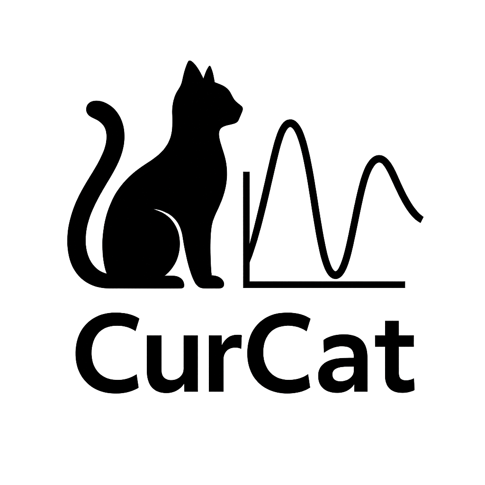

<div align="center">

  

  <h1>Curcat — Curve Catcher — оцифровка графиков из растров</h1>

</div>

---

## 🚀 Установка и запуск

Требования: Rust (1.80+).

```bash
cargo run --release
```

Открыть сразу файл при старте (аргумент командной строки):

```bash
# бинарник
./target/release/curcat path/to/image.png

# через cargo
cargo run --release -- path/to/image.png
```

Статическая сборка для Linux (musl, 🐳 внутри Docker):

```bash
./build_musl.sh
```

Сборка для RedOS (🐳 внутри Docker):

```bash
./build_redos.sh
```

🐳 Варианты базового Docker-образа:

```bash
# UBI 8 (по умолчанию)
./build_redos.sh --ubi8

# UBI 7
./build_redos.sh --ubi7

# Произвольный образ
./build_redos.sh --image registry.red-soft.ru/ubi7/ubi:latest
```

## 🧭 Использование

1) Откройте изображение (кнопка или перетаскивание в центральную область).
2) В правой панели выполните калибровку осей:
   - Введите значения для P1/P2 и кликните по двум соответствующим точкам на изображении (для X и Y отдельно).
   - Выберите тип значения (`Float`/`DateTime`) и масштаб (`Linear`/`Log10`).
3) Кликайте по графику для набора точек; при необходимости перемещайте точку: удерживайте `Shift` и перетаскивайте ЛКМ ближайшую точку.
4) В блоке «Export points» выберите режим:
   - Interpolated curve — экспорт равномерно распределённых по X точек интерполированной кривой.
     - Алгоритм интерполяции: Linear (по умолчанию), Step (previous), Natural cubic spline.
     - Ползунок «Samples» задаёт число точек выборки.
   - Raw picked points — экспорт только отмеченных точек без интерполяции.
     - Доп. колонки (опционально):
       - distance — расстояние до предыдущей точки (первая строка пустая);
       - angle_deg — угол на точке в градусах (первая и последняя строки пустые).
5) Экспортируйте результат в CSV/XLSX.

🕒 Поддерживаемые форматы даты/времени: `YYYY-MM-DD`, `YYYY-MM-DD HH:MM[:SS]`, а также популярные локальные варианты (`DD.MM.YYYY`, `YYYY/MM/DD`, и др.).

**🖼️ Форматы изображений**

- Поддержка: PNG, JPG/JPEG, GIF, BMP, TIFF (TIF), WEBP, ICO, TGA, PNM (PBM/PGM/PPM), HDR, DDS.
- Нюансы загрузки:
  - Анимация GIF/WEBP: берётся только первый кадр (без воспроизведения).
  - Глубина/диапазон: всё конвертируется в 8‑бит RGBA; HDR/16‑бит данные теряют динамику.
  - Ориентация JPEG (EXIF): автоматом не применяется — повернуть можно кнопками «↺/↻ 90°».
  - Цветопрофили: CMS не применяется; возможны небольшие отличия на широких гаммах.
  - TIFF/ICO: открывается первая страница/иконка подходящего размера (без выбора).
  - DDS: поддерживаются распространённые форматы (DXT1/3/5 и т. п.); возможна инверсия оси Y в редких файлах.
  - PNM/TGA/HDR: встречаются варианты с разной ориентацией/гаммой; при 8‑бит конверсии возможна потеря деталей в светах/тенях.

**🛡️ Защитные лимиты при декодировании**

- Ограничения для предотвращения «zip‑бомб» и чрезмерного потребления памяти (настраиваются в конфиге, ниже значения по умолчанию):
  - Максимальная ширина/высота: 12 000 пикселей на сторону.
  - Максимум пикселей (после декодирования): ~80 МП.
  - Лимит памяти декодера: ~512 МиБ.
- Если изображение превышает эти ограничения, загрузка будет отклонена с понятной ошибкой.

## ⌨️ Горячие клавиши и жесты

- ЛКМ — добавить точку.
- Shift + ЛКМ (тащить) — переместить ближайшую точку.
- Средняя кнопка (MMB) — панорамирование (вкл/выкл тумблером «MMB pan» вверху).
- Ctrl + колесо — масштабирование изображения.
- Ctrl + B — показать/скрыть боковую панель.
- Ctrl + O — открыть изображение (диалог).
- Ctrl + Shift + C — экспорт в CSV.
- Ctrl + Shift + E — экспорт в Excel (XLSX).
- Ctrl + Shift + D — очистить все точки.
- Ctrl + Z — откат/Undo последней точки.

В верхней панели также есть кнопка «⟷ Show/Hide side» для быстрого переключения.

## ⚙️ Конфигурация (curcat.toml)

Необязательный файл конфигурации можно положить рядом с бинарником,
в XDG‑каталогах (`~/.config/curcat/curcat.toml`) или в системном профиле приложения
(`~/.config/Curcat/Curcat/curcat.toml`). Поля имеют разумные значения по умолчанию.

Пример:

```toml
[curve_line]
color = [80, 200, 120]
alpha = 1.0
thickness = 2.0

[curve_points]
color = [200, 80, 80]
alpha = 1.0
radius = 3.0

# Скорость панорамирования при зажатой средней кнопке
pan_speed = 1.0

[crosshair]
color = [200, 200, 200]
alpha = 0.8

[attention_highlight]
# Цвет/прозрачность мигающего контура подсказок (кнопка открытия, поля калибровки)
color = [220, 70, 70]
alpha = 1.0
thickness = 1.2

[image_limits]
# Максимальная ширина/высота для декодирования (px)
image_dim = 12000
# Максимальное число пикселей (после декодирования)
total_pixels = 80000000
# Лимит памяти на аллокации декодеров (bytes)
alloc_bytes = 536870912
```

Поле `attention_highlight` управляет цветом и толщиной «мигающего» контура, который подсказывает, что нужно открыть изображение и заполнить калибровку.

## 📤 Экспорт: формат данных

Во всех вариантах экспорта первые две колонки — `x`, `y` (в соответствии с выбранными единицами осей: числа или дата/время).

Для режима «Raw picked points», если включены дополнительные метрики, добавляются колонки:

- `distance` — расстояние до предыдущей точки; для первой строки — пусто.
- `angle_deg` — внутренний угол в текущей точке (градусы); для первой и последней строки — пусто.

ℹ️ Примечание: расчёты выполняются по откалиброванным числовым координатам X/Y. Если X — `DateTime`, внутренняя шкала X — секунды.

## 🏗️ Архитектура

- `src/app.rs` — основное приложение на egui/eframe и логика UI.
- `src/types.rs` — типы осей/значений, парсинг/форматирование, преобразования и калибровка.
- `src/image_util.rs` — загрузка и поворот изображения, текстуры egui.
- `src/interp.rs` — интерполяция (Linear, Step/hold, Natural cubic spline) и структуры данных.
- `src/export.rs` — экспорт CSV и XLSX.
- `src/config.rs` — стили/скорости и загрузка конфигурации TOML.

## 🗺️ Дорожная карта к релизу

- [x] Дополнительные интерполяции: ступенчатая и натуральный кубический сплайн.
- [ ] Сглаживание/аппроксимация кривой.
- [ ] Авто расстановки пинч-точек на изображении.
- [ ] Импорт PDF/SVG.
- [ ] Слои/сетку/привязки; улучшенная навигация и подсказки.
